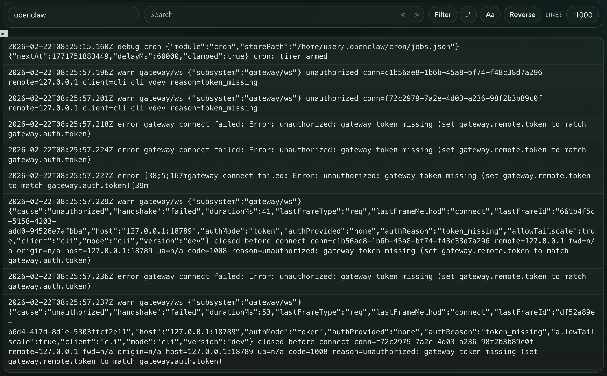
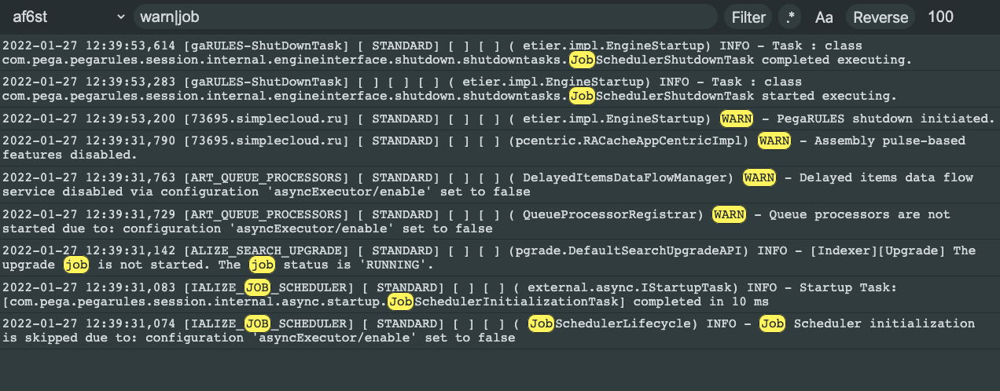

# Web tail

Web application to view lines from file on local system or on remote server built with [Svelte](https://github.com/sveltejs/svelte)

## Installation

Download and unpack `web-tail-[platform].zip` from [latest release](https://github.com/mishankov/web-tail/releases/latest)

Docker image is also available [here](https://github.com/mishankov/web-tail/pkgs/container/web-tail)

## Configuration

In unpacked folder edit `web-tail.config.toml` file

- `port` - Port that Web tail will run on. Defaults value is `4444`
- `allowedOrigins` - List of allowed origins for WebSocket connections. Defaults value is ["http://localhost:4444", "http://127.0.0.1:4444"]
- `servers` - reusable servers configuration
  - `name` - name of server to use in `sources` configs
  - `host` - host of remote server. Mandatory field for source types `ssh:*`
  - `port` - port of remote server. Mandatory field for source types `ssh:*`
  - `username` - username for ssh connection to remote server. Mandatory for source types `ssh:*`
  - `password` - password to authenticate on remote server. Either this or `privateKeyPath` is mandatory for source types `ssh:*`
  - `privateKeyPath` - path to file with private key to authenticate on remote server. Either this or `password` is mandatory for source types `ssh:*`
- `sources` - list of sources to tail lines from
  - `name` - name of source. Mandatory field
  - `type` - type of source. Possible values: `local:file`, `local:docker`, `ssh:file`, `ssh:docker`. Mandatory field
  - `path` - path to file. Mandatory field for source types `*:file`
  - `serverName` - name of a server from `servers` list
  - `containerId` - Docker container ID. Mandatory field for source types `*:docker`
  - `host` - host of remote server. Mandatory field for source types `ssh:*`
  - `port` - port of remote server. Mandatory field for source types `ssh:*`
  - `username` - username for ssh connection to remote server. Mandatory for source types `ssh:*`
  - `password` - password to authenticate on remote server. Either this or `privateKeyPath` is mandatory for source types `ssh:*`
  - `privateKeyPath` - path to file with private key to authenticate on remote server. Either this or `password` is mandatory for source types `ssh:*`

## Usage

Options from left to right:

- Dropdown to select one of sources from `web-tail.config.toml`
- Search field. Matching results will be selected. Search is case insensitive by default
- `Filter` toggle. If enabled only lines with matching results are shown
- `.*` toggle. If enabled treats text in search field as regular expression
- `Aa` toggle. If enabled makes search case sensitive
- `Reverse` toggle. If enabled latest lines shown on top
- Max lines field. How much lines will be shown

## Development

Set environment variable `ASSETS=dist/public` before doing `go run ./server` to use preemtively compiled assets
